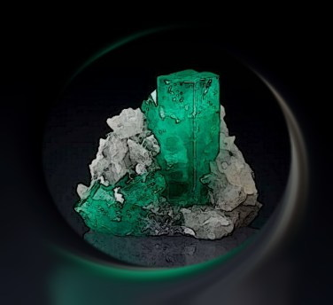
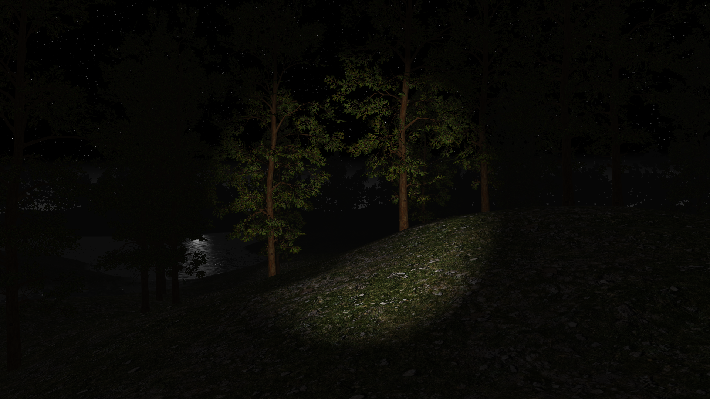
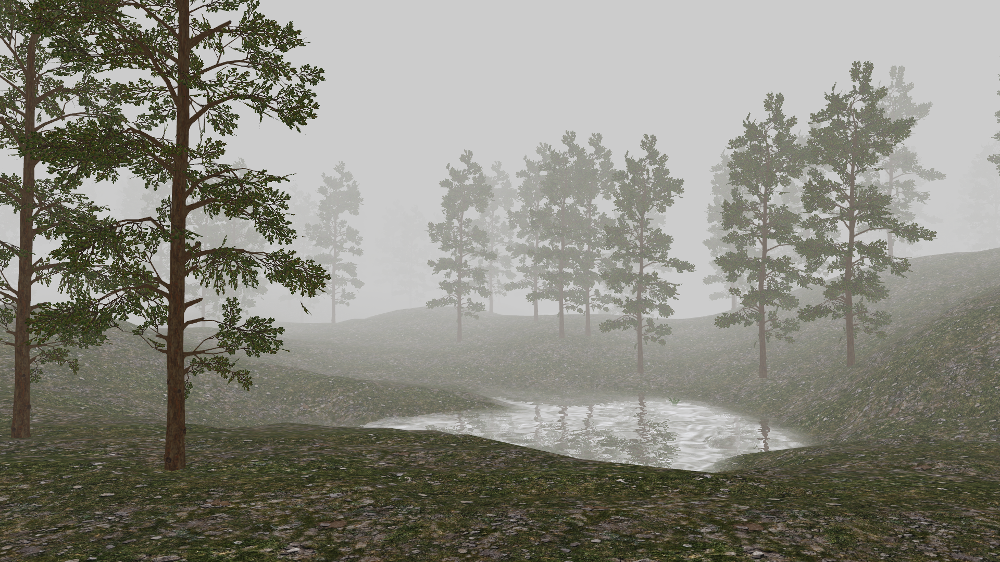
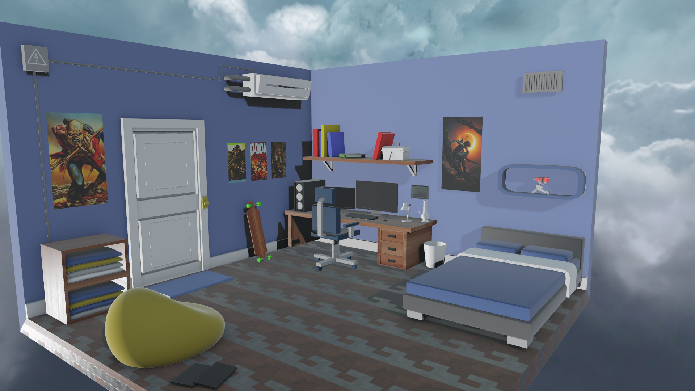
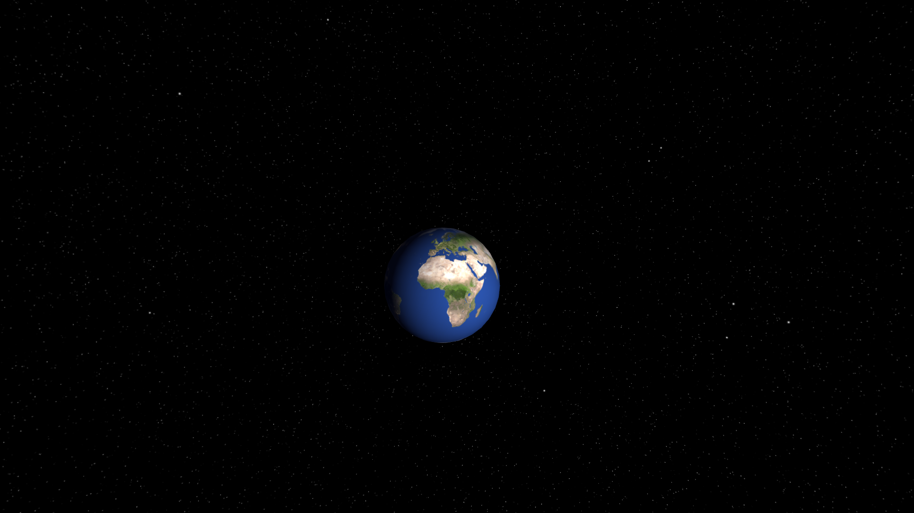
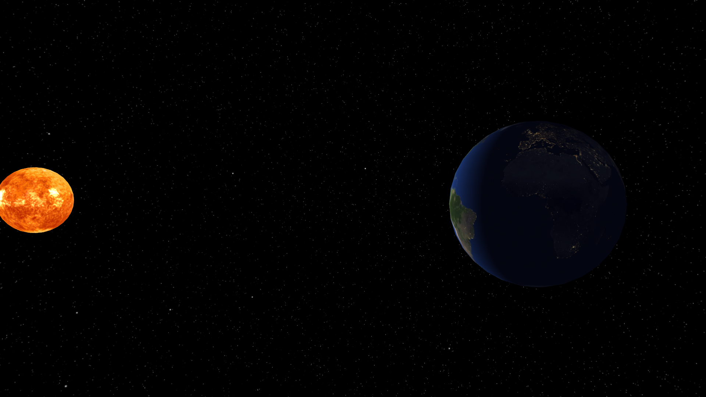
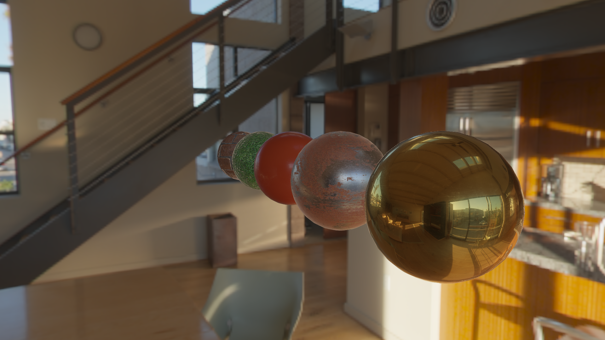
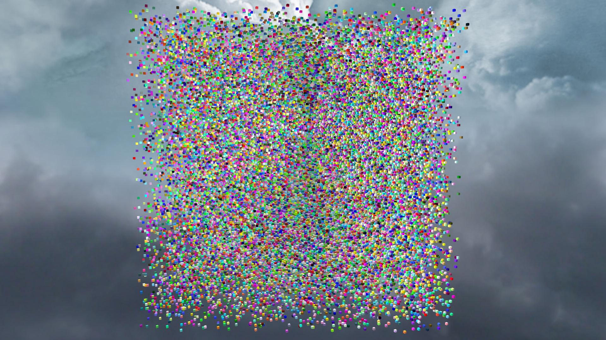

# Beryl
A Java Framework for building real time graphics applications. This is my final project of the Software Engineering degree at [ULPGC](https://www.ulpgc.es/).

 

Beryl is a framework purely written in Java to develop high performance graphics applications.
The main purpose of this project is to demonstrate the potential of the Java platform in making this kind of applications.

I have designed Beryl to run 3D desktop games and simulations, focusing on readability and performance, taking advantage of new hardware capabilities.
One of the goals is the support of multiple graphics APIs, especially [Vulkan](https://www.khronos.org/vulkan/).

To achieve this, I worked with modern OpenGL techniques, following the AZDO philosophy ([Approaching Zero Drive Overhead](https://www.slideshare.net/CassEveritt/approaching-zero-driver-overhead)), that is,
reducing the driver's work as much as possible, while putting much more responsibility on the application code. In other words, using OpenGL like Vulkan.

## Features

It supports multiple light sources, cascaded shadow maps, water, 3D sound, dynamic skybox, fog, 3D model loading, and various shading models, supporting Phong and PBR (Physically Based Rendering) Metallic-Roughness for now.
All of these functionalities are going to be continually improved in the future, as well as adding many others.

I have develop some example scenes to test all features out:

###Open World Scenes

You can develop outdoor 3D environments very easily with Beryl, like, for example, a beautiful forest:

*Forest daytime, 1000 trees, water and shadows*

Maybe you prefer adventuring into the woods at night with a flashlight:

*Forest at night, player porting a flashlight*

You can't imagine how creepy becomes a forest with some fog around...

*Forest with dense fog*

### Indoor scenes

You can also render interiors, like your dream bedroom:

*Room scene, rendering with PBR*

### Lighting and texture mapping

Using 2 textures and the sun light, you can simulate the Earth rotation and see the lights on the dark side!

*Earth, light side*

 
*Earth, dark side*

### Physically Based Rendering scenes

Create incredible scenes with physically accurate algorithms and HDR environments to make the scene feel real.

*Different PBR materials, rendered with IBL*

*Rusted iron reflecting night lights*

*PBR Model with metallic workflow: the amazing [Cerberus](https://artisaverb.info/Cerberus.html) model*

### Performance

Beryl uses bindless textures, frustum culling and multithreading drawing command generation with indirect rendering. This means that multiple
objects are drawn at once, boosting the performance up to 400% faster in some scenes.

*Stress Test. 50000 cubes are drawn, all of them rotating each frame, and 1000 cubes are getting destroyed and created every 100 ms. I get 105 FPS on GTX 970*

## Framework architecture

But Beryl is not only graphics; it has a game engine infrastructure, from Logging to an Entity-Component System.

*TODO...*

