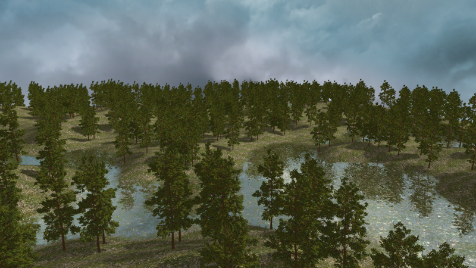
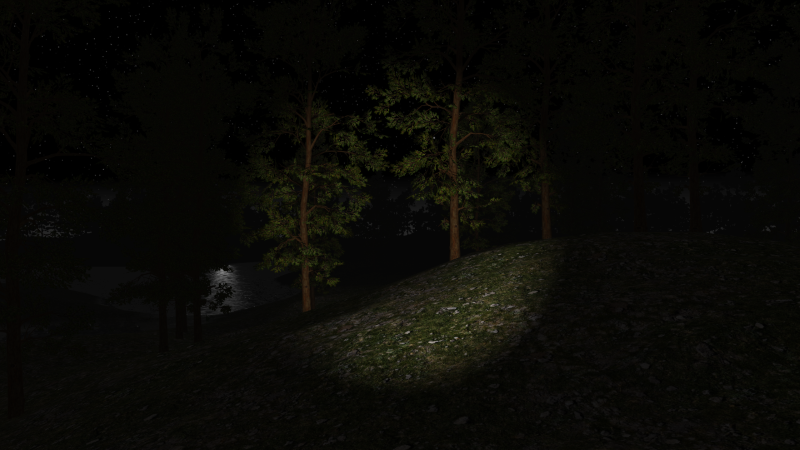
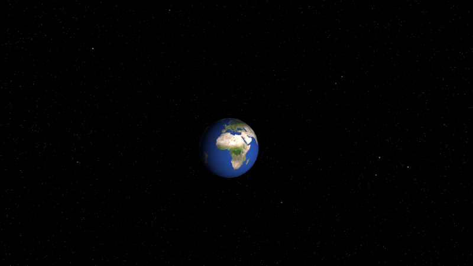
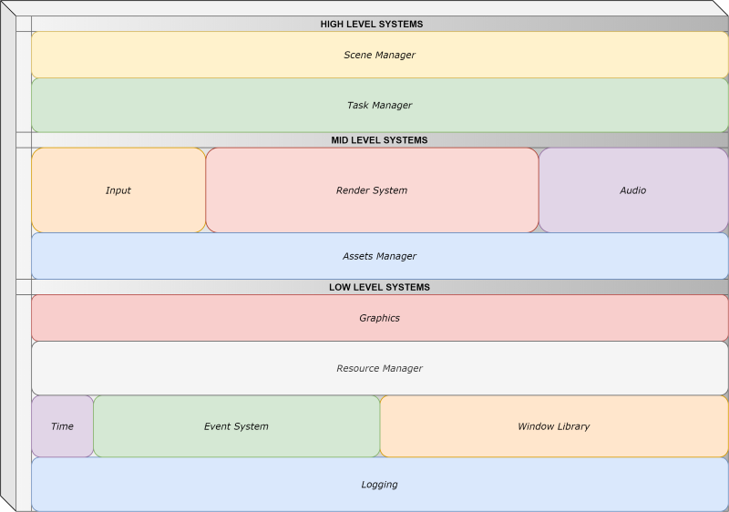

# Beryl
A Java Framework for building real time graphics applications. This is my final project of the Software Engineering degree at [ULPGC](https://www.ulpgc.es/).

 

Beryl is a framework purely written in Java to develop high performance graphics applications.
The main purpose of this project is to demonstrate the potential of the Java platform in making this kind of applications.

I have designed Beryl to run 3D desktop games and simulations, focusing on readability and performance, taking advantage of new hardware capabilities.
One of the goals is the support of multiple graphics APIs, especially [Vulkan](https://www.khronos.org/vulkan/).

To achieve this, I worked with modern OpenGL techniques, following the AZDO philosophy ([Approaching Zero Drive Overhead](https://www.slideshare.net/CassEveritt/approaching-zero-driver-overhead)), that is,
reducing the driver's work as much as possible, while putting much more responsibility on the application code. In other words, using OpenGL like Vulkan.

## Features

It supports multiple light sources, cascaded shadow maps, terrain generation, water, 3D sound, dynamic skybox, fog, 3D model loading, and various shading models, supporting Phong and PBR (Physically Based Rendering) Metallic-Roughness for now.
All of these functionalities are going to be continually improved in the future, as well as adding many others.

I have develop some example scenes to test all features out:

### Open World Scenes

You can develop outdoor 3D environments very easily with Beryl, like, for example, a beautiful forest:



<sup>*Forest daytime, 1000 trees, water and shadows*</sup>

Maybe you prefer adventuring into the woods at night with a flashlight:



<sup>*Forest at night, player porting a flashlight*</sup>

You can't imagine how creepy becomes a forest with some fog around...


<sup>*Forest with dense fog*</sup>

### Indoor scenes

You can also render interiors, like your dream bedroom:


<sup>*Room scene, rendering with PBR*</sup>

### Lighting and texture mapping

Using 2 textures and the sun light, you can simulate the Earth rotation and see the lights on the dark side!



<sup>*Earth, light side*</sup>

 

<sup>*Earth, dark side*</sup>

### Physically Based Rendering scenes

Create incredible scenes with physically accurate algorithms and HDR environments to make the scene feel real.


<sup>*Different PBR materials, rendered with IBL*</sup>


<sup>*Rusted iron reflecting night lights*</sup>


<sup>*PBR Model with metallic workflow: the amazing [Cerberus](https://artisaverb.info/Cerberus.html) model*</sup>

### Performance

Beryl uses bindless textures, frustum culling and multithreading drawing command generation with indirect rendering. This means that multiple
objects are drawn at once, boosting the performance up to 400% faster in some scenes.


<sup>*Stress Test. 50000 cubes are drawn, all of them rotating each frame, and 1000 cubes are getting
 destroyed and created every 100 ms. I get 105 FPS on GTX 970*</sup>

## Framework architecture

The framework contains individual, single responsibility systems, that can be divided in 3 different levels:



<sup>*Beryl Systems*</sup>

Each system can depend on other systems in the same or lower levels, but never on higher layers. This makes a hierarchical architecture that
correctly defines the order in which these systems have to be initialized and terminated.    


### Scenes and the Entity Component System

Beryl uses a scene system to update and render your worlds. A scene contains entities, which are the basic world
objects. An entity is nothing by itself, but they can contain multiple components.
A component can be just data, may define a behaviour, or both. With this system, you get rid of complex inheritance hierarchies,
so the application is easier to scale.

An entity only exists within its scene. Entities can only be in 1 scene, and a component must be in only 1 entity. In addition, 
an entity can only contain 1 component of a specific class, but can contain multiple components of the same type.

As you can see, the component **class** and the component **type** are different things. The class of a component refers to its Java class,
i.e. **UpdateMutableBehaviour**. However, the **type** is usually the base class of that kind of components, i.e. **AbstractBehaviour**.

So, you cannot add 2 **UpdateMutableBehaviour** components in the same entity, but it may contain 100 different implementations of **AbstractBehaviour**.


<sup>*Simple class diagram of the Beryl Scene Entity-Component System*</sup>

Besides, the components are group by type, which are controlled by component managers, one for each type. This divides the  
responsibility in multiple classes, so it is more maintainable, readable and faster. Faster because the scene does not have to
traverse huge and complex graphs to search and update or render the required components, but update lists of components of one type.
This lists, which are implemented as arrays, are super fast to iterate, can improve cache locality and most important, allows parallel
processing of each component.


### Getting started

Developing with Beryl is very easy and straightforward. First of all, you need to extend the abstract class **BerylApplication**:

```java
public class MyGame extends BerylApplication {

    @Override
    public void onStart(Scene scene) {
        // Cool things here
    }

}
``` 

When you inherit from **BerylApplication**, you must implement the method *onStart*. It will give you a **Scene** instance, so you can start building up your world!

For example, lets make a simple example of a cube rotating each frame, a directional light and a skybox:

```java
    @Override
    public void onStart(Scene scene) {
    
        // First of all, position the camera so we can see the cube.
        scene.camera().position(0, 0, 20);
        
        // Create the cube entity. An entity may have a name, and it must be unique.
        Entity cube = scene.newEntity("The Cube");
        
        // Add a Transform. It defines the position, scale and rotation of an object in the scene.
        // A Transform is necessary in visible objects, but not in invisible objects, like in game controllers for example.
        // Lets set this cube at position (0, 0, 0) and scale it by 2.
        cube.add(Transform.class).position(0, 0, 0).scale(2.0f);
        
        // Now attach a mesh view to it to actually see it on the scene.
        // Common meshes, like cube, sphere or quad, are already loaded and ready to use.
        StaticMesh cubeMesh = StaticMesh.cube();
        
        // Now we need a material. Lets create a material with a green color.
        // Materials have a unique name, and are created through a factory.
        Material material = PhongMaterial.getFactory().getMaterial("My Material", mat -> {
            // If the material named "My Material" has not been created, then this piece of code will be executed.
            // Here you can initialize the material. The materials are mutable, so you can change their properties at runtime.
            mat.color(Color.colorGreen()).shininess(32.0f);
        });

        // Create a StaticMeshInstance component and attach a new StaticMeshView to it.
        // A mesh view simply binds a mesh with a material. A mesh instance is a component that can have multiple mesh views.
        cube.add(StaticMeshInstance.class).meshView(new StaticMeshView(cubeMesh, material));

        // Now, lets add a small behaviour script that rotates the cube each frame.
        // UpdateMutableBehaviour is a special type of behaviour component that can change its onUpdate method at runtime.
        cube.add(UpdateMutableBehaviour.class).onUpdate(self -> {
            // This will be executed each frame. All onUpdate methods are invoked at the same time, in parallel.
            // If you are going to perform tasks that should be executed in a single thread, use onLateUpdate instead.
            // "Self" represents this behaviour component. You can get the components of its entity with the "get" method:
            Transform transform = self.get(Transform.class);
            transform.rotateY(Time.seconds());
        });
    
        // Now, lets add the directional light
        scene.environment().lighting().directionalLight(new DirectionalLight().direction(0, 0, 1));

        // And finally, set the skybox
        scene.environment().skybox(SkyboxFactory.newSkyboxHDR("Path-to-skybox.hdr"));
    }

}
``` 

Awesome! You have built your first application with Beryl! Now, its time to actually launch it:

```java
public class MyGame extends BerylApplication {

    public static void main(String[] args) {
        // Simply call Beryl's launch method with an instance of your BerylApplication class.
        Beryl.launch(new MyGame());
    }

    @Override
    public void onStart(Scene scene) {
        // ...
    }

}
``` 

### Configuration

You can customize many aspects of Beryl execution, like debugging, enable asserts, MSAA, logging parameters, and much more.

These configuration parameters are stored in static final (immutable) variables when Beryl launches, so you can only modify them before
starting Beryl.

To modify the configuration settings, use the **BerylConfiguration** variables:

```java
public class MyGame extends BerylApplication {

    public static void main(String[] args) {
        // Customize configuration before Beryl launches:
        BerylConfiguration.MSAA_SAMPLES.set(8);
        BerylConfiguration.SCENE_SHADING_MODEL.set(ShadingModel.PHONG);
        BerylConfiguration.FIRST_SCENE_NAME.set("My awesome Beryl game");
        // BerylConfigurationHelper contains useful methods to set predefined sets of configurations.
        BerylConfigurationHelper.debugConfiguration();
        // Finally, launch your application.
        Beryl.launch(new MyGame());
    }

    @Override
    public void onStart(Scene scene) {
        // ...
    }
}
```


